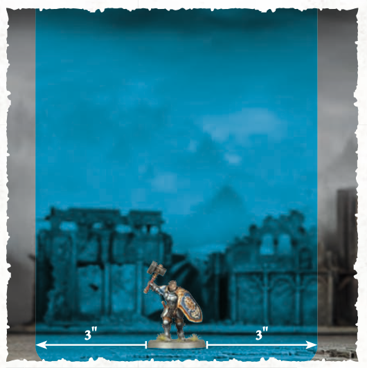

import WarscrollAbility from '@site/src/components/WarscrollAbility';

## 1.0 Core Concepts

Battles in Warhammer Age of Sigmar are fought on a surface that is referred to as the battlefield. Each battle uses a scenario called a **battleplan**, which will explain how to set up the **battlefield** and how to determine the winner.

Each player is the **commander** of an **army**. Each army belongs to a **faction** and is made up of groups of models called units. Models and units in your army are referred to as **friendly** models and units, and models and units in your opponent’s army are referred to as **enemy** models and units.

:::tip
**The Most Important Rule**

While you re playing Warhammer Age of Sigmar, you might encounter a rules situation that you aren't sure how to resolve. If you're new to the game, we recommend discussing with your opponent and agreeing on a fair and reasonable solution so you can get on with the game as quickly as possible. Otherwise, the **Special Rules** section includes detailed instructions on how to resolve these situations.
:::

:::tip
**Designer's Notes**

Many pages have grey boxes in the sidebar, like this one, that provide commentary on the rules or othersupplementary information.

These boxes provide additional insight or context, but do not contain any rules needed to play the game.
:::

:::danger
- Many pages in the rules have red boxes in the sidebar, such as this one.  
- These give you short summaries of important rules.
- If you need to read a rule in full, refer to the main text.
:::

:::tip
**RULES UPDATES**

We are committed tosupporting Warhammer Age of Sigmar rules via regular free updates based on community feedback. Please check warhammer-community.com to download the latest updates and FAQs.
:::
## 2.0 Tools of War

To fight a battle, you will need:

* A tape measure 
* Some dice
* A surface to play on (the battlefield) 
* 2 armies of Citadel Miniatures

### 2.1 Measuring Distances

Distances in Warhammer Age of Sigmar are measured in **inches** ("), between the closest points on the bases of the models you're measuring to and from. You can measure distances whenever you wish. When measuring the distance between units, always measure the distance between the closest points on the bases of the closest models in each unit. If a model does not have a base, measure to and from the closest point on the model instead.

#### 2.1.1 Within and Wholly Within

A **model** is **within** a certain distance of something (e.g. another unit, a territory or an objective) if any part of its base is within that distance. A **model** is **wholly within** a certain distance of something if every part of its base is within that distance.

A **unit** is **within** a certain distance of something if any part of the base of any model in the unit is within that distance. A **unit** is **wholly within** a certain distance of something if every part of the bases of all of the models in the unit is within that distance.

### 2.2 Dice

Warhammer Age of Sigmar uses six-sided dice, often abbreviated to **D6**.

* Some rules refer to ‘2D6’, ‘3D6’ and so on – in such cases, roll a number of dice equal to the number before ‘D6’ and add the results together.
* A roll of ‘2+’ means a roll of 2 or more, a roll of ‘3+’ means a roll of 3 or more, and so on.
* If a rule requires you to roll a D3, roll a dice and halve the total, rounding up. For **D3** rolls, a roll of ‘2+’ means a result of 2 or more after halving the total and rounding up.
* Effects that allow you to modify a dice roll are called **modifiers**.
* Some rules allow you to re-roll a dice roll, which means you get to roll some or all of the dice again. You cannot re-roll a dice more than once, and re-rolls happen before modifiers to the roll (if any) are applied.
* If you are instructed to roll off, each player should roll a dice. Whichever player has a higher roll wins the roll-off. If the result is a tie, each player should roll off again until there is a clear winner, unless otherwise specified.

## 3.0 Factions

Each army belongs to a **faction**, e.g. Stormcast Eternals or Skaven.  
Each faction has a set of **faction rules**, which include **battle traits**,  
**battle formations**, **enhancements** and **lores**. These can be found in various publications but most commonly in the faction’s **battletome**.

## 4.0 Warscrolls

The rules for each unit are contained on a warscroll:

1. The **MOVE** characteristic determines how quickly the uni6t c"an move across the battlefield (see [15.0](#150-movement)).
2. The **HEALTH** characteristic determines how many damage points can be allocated to a unit before a model in the unit is slain (see [18.2](#182-allocating-damage)).
3. The **CONTROL** characteristic determines how well each model in the unit can contest objectives (see [32.2](#322-objective-control)).
4. The **SAVE** characteristic determines how well armoured the unit is. This characteristic is the roll you need to equal or exceed to save a model from harm, so a lower value is better (see [17.0](#170-the-attack-sequence)).
5. The **UNIT TYPE**.
6. The **KEYWORDS** that the unit has (see [5.1](#51-keywords))
7. The **WEAPONS** the unit is armed with. Weapons are either **melee weapons**, used to make **combat attacks**, or **ranged weapons**, used to make shooting attacks. Each weapon has its own characteristics (see [16.0](#160-picking-targets)).
8. Any special **ABILITIES** the unit can use (see [5.0](#50-abilities)).

## 5.0 Abilities

The vast majority of things that units can do in Warhammer Age of Sigmar are called abilities. This is an example of an ability:

:::tip
**Ability icons** give you an idea what kind of effect the ability has at a glance.

 Movement Ability
Offensive Ability
Defensive Ability
Shooting Ability
Rally Ability
Specia Ability
Control Ability
:::

### 5.1 Keywords

Some abilities have one or more **keywords** listed at the bottom of the ability on their **keywords bar**, e.g. the ‘Shoot’ ability shown above has the **Core**, **Attack** and **Shoot** keywords. Units also have a keywords bar on their warscroll.

Keywords let you know which abilities can be used or which units can be picked as targets for an ability. For example, the ‘Charge’ ability can only be used by a unit if it did not use an ability with the **Run** or **Retreat** keyword earlier in the turn. The singular and plural forms of a keyword are synonymous for rules purposes.

### 5.2 Using Abilities

The **timing** of an ability tells you when it can be used. When using an ability, follow these steps:

1. **Declare the Ability**: Tell your opponent which ability is beeing used. If the ability has **Declare** instructions, resolve them at this step.
2. **Use Reactions**: Starting with the active player (see [12.0](#120-start-of-battle-round)), the players alternate using any abilities with an appropriate **Reaction** timing.
3. **Resolve the Effect**: Follow the instructions in the **Effect** part of the ability.

### 5.3 The Rules of One

- A unit cannot use more than 1 **Core** ability per phase (see [14.0](#140-universal-core-abilities)).
- A unit cannot use the **same ability** more than once per phase, unless specified otherwise.
- A unit cannot be affected by the same **passive ability** more than once at the same time. For example, if a unit is within range of two different terrain features that have the ‘Cover’ passive ability, the effect only applies to it once.

### 5.4 Passive Abilities

Abilities that have the **Passive** timing are called **passive abilities**. Passive abilities are not declared. The effects of passive abilities always apply if the conditions of the ability are met, and they must be applied if it is possible to do so.

## 6.0 Visibility

A target model is visible to another model (which we’ll call the ‘observing model’) if you can draw a straight line through the air (whether horizontal, diagonal or vertical) from any point on the observing model to any point  
on the target model that does not intersect any objects except for other models in the observing model’s unit. A target unit is visible to an observing unit if at least 1 model in the target unit is visible to at least 1 model in the observing unit. A model is always considered to be visible to itself.

Even though only half of this Liberator can be seen, he counts as being visible. A model is visible no matter how much of the model is blocked from sight or how little of it is visible; if any part of the model can be seen, it is visible.

An observing model's visibility can be blocked by enemy models. The Rat Ogor in this shot is visible to the Liberator on the right but is not visible to the Liberator on the left because it is hidden by the Plague Furnace.

The Liberator at the back of this unit can see through their fellows. Models don't block the visibility of other models in their unit - it is assumed that they fight in such a way as to not obstruct one another's attacks.

:::danger
If any part of another model can be seen by an observing model, both the target model and its unit are visible to that observing model.
:::

:::tip
In some cases, it might not be immediately clear whether a model is visible. If so, stoop down to get a look from behind the observing model. If any part of the other model is visible, even if it is just the tip of a spear, then that model is visible for rules purposes.
:::

## 7.0 Combat Range

Each model has a **combat range** that extends 3" horizontally from its base and any distance vertically from that circle to form a cylinder. The combat range of a unit extends 3" horizontally and any distance vertically from every model in that unit. Units from opposing armies that are within each other's combat range and that are **visible** to each other are **in combat** with each other. When a unit that is not in combat enters the combat range of a visible enemy unit, it **moves into combat**.

:::danger
- A unit's combat range extends 3" out from every model in that unit.
- If any enemy models are within a unit's combat range and visible to it, that unit is in combat.
:::

A model's combat range extends 3" horizontally outwards from it in all directions and an infinite distance vertically. Note that this is measured from the edge of its base, not the centre.

Even though both Rat Ogors are within the combat range of the Liberator, the Rat Ogor behind the wall is not visible to the Liberator and is therefore not in combat.

A unit's combat range extends 3" horizontally and any distance vertically from all models in the unit. As you can see, this forms a sort of 'cloud'.

A unit is in combat with a visible enemy unit if any of its models are within the combat range of that enemy unit. Even though 1 Rat Ogor is not within the Liberators' combat range, its unit is still in combat.

# Setting Up For Battle

## 8.0 The Armies

Before starting a battle, both players will need an **army**. Some battlepacks use pre-made armies, while others include rules on how to fill your army roster.

:::danger
Unless specified otherwise in the battlepack or battleplan:

- Set up objectives.
- Set up terrain.  
- Determine territories.
- Deploy armies.  
- The player who lost the roll-off to choose territories decides who begins deployment.
:::

## 9.0 Battleplans

Before any battle, you'll need to pick a **battleplan**. A variety of battleplans are available in each **battlepack**, and additional battleplans are available in other publications. Each battleplan is a scenario to play - it outlines **territories**, **objectives** and **victory conditions**, in addition to any special rules that apply to the battle.

### 9.1 Battlefield Map

Each battleplan includes a **battlefield map** that is divided into **quarters**. The map will show the locations of any **objectives** and the players' **territories**. Each battlepack or battleplan will indicate the recommended battlefield size based on the size of game you are playing

#### 9.1.1 Setting Up Objectives and Terrain Features

Many battlefields have key locations called **objectives**, and almost all battlefields have **terrain features** such as buildings, ruins and woods. Unless otherwise specified, players should first set up objective markers at the locations indicated by a gold circle (!!!) on the deployment map, then set up terrain features in a mutually agreeable manner. Many battlepacks and battleplans include further instructions for setting up terrain.

#### 9.1.2 Territories

Unless otherwise specified in the battlepack or battleplan, after terrain has been set up, the players should roll off. The winner decides which territory belongs to which player. Their opponent decides which player begins deployment.

- A unit is within a territory if any part of the base of any model in the unit is within that territory.
- A unit is wholly within a territory if every part of the base of every model in the unit is within that territory.
- The area of the battlefield that is neither player's territory is neutral territory.

### 10.0 The Deployment Phase

Once the battlefield is ready, the players must deploy their armies. This is done in a special phase called the deployment phase. The deployment phase happens once per battle, before the start of the first battle round (see [12.0](#120-start-of-battle-round)).

- STEP 1 - DEPLOY FACTION TERRAIN FEATURES

	Some factions have **faction terrain features**, which have their own warscrolls and are set up using **DEPLOY TERRAIN** abilities. The player who begins deployment must use **DEPLOY TERRAIN** abilities first, followed by their opponent.
-  STEP 2- DEPLOY ARMIES
	
	Unless otherwise specified in the battleplan, the players alternate using **DEPLOY** abilities to deploy their units, starting with the player who begins deployment. Once one player has no more **DEPLOY** abilities to use, their opponent must continue to use **DEPLOY** abilities until they also have no more to use.
- STEP 3 - USE DEPLOYMENT PHASE ABILITIES
	
	After both players have finished deploying their units, the player who begins deployment can use any **Deployment Phase** abilities that are **not** **DEPLOY** or **DEPLOY TERRAIN** abilities, in the order of their choosing, then their opponent can do the same.

:::danger
- Player who begins deployment can use any **DEPLOY TERRAIN** abilities, followed by their opponent.
- Players alternate using **DEPLOY** abilities.
- Player who begins deployment must use any other Deployment Phase abilities, then their opponent can do so.
:::

### 10.1 Universal Deployment Phase Abilities

<WarscrollAbility ability={{"name":"Deploy Unit","header":{"icon":"special","color":"black","text":"Deployment Phase"},"declare": "Pick a **unit** from your army roster that has not been **deployed** to be the target.", "effect":"Set up the target unit wholly within friendly territory and more than 9\" from enemy territory. After you have done so, it has been **deployed**.", "keywords":["Deploy"]}} />

<WarscrollAbility ability={{"name":"Deploy Faction Terrain","header":{"icon":"special","color":"black","text":"Deployment Phase"},"declare": "Pick a friendly **faction terrain feature** that has not been **deployed** to be the target.", "effect":"Set up the target faction terrain feature wholly within friendly territory, more than 3\" from all objectives and other terrain features. After you have done so, it has been **deployed**.", "keywords": ["Deploy Terrain"]}} />

<WarscrollAbility ability={{"name":"Deploy Regiment","header":{"icon":"special","color":"black","text":"Deployment Phase"},"declare": "Pick a **regiment** from your army roster to be the target. No units in that regiment can have already been **deployed**.", "effect":"Keep using **DEPLOY** abilities without alternating until all units in that regiment have been **deployed**. You cannot pick units that are not in that regiment as the target of any of those **DEPLOY** abilities.", "keywords":["Deploy"]}} />

A **regiment** is a collection of units. It is one of the main building blocks of an army (see 'Army Composition' in the Advanced Rules).

Some factions have special **DEPLOY** abilities, such as the 'Scions of the Storm' ability of the Stormcast Eternals.

# The Battle

## 11.0 Battle Sequence

Each battle lasts a number of **battle rounds**, specified in the battleplan. During each battle round, each player will take a **turn**. Each turn is broken down into multiple phases (see [13.0](#130-turn-phases)).

## 12.0 Start of Battle Round

At the start of each battle round, follow these steps:

1. **Determine the Active Player**: If it is the **first** battle round, the player who finished setting up their army first decides who will take the first turn (unless otherwise specified in the battlepack or battleplan).

	If it is not the first battle round, the players make a roll-off called the priority roll and the winner decides who will take the first turn. If the roll-off is a tie, the player who took the first turn in the previous battle round decides who will take the first turn in the current battle round.  
	
    When it is a player's turn, regardless of whether they take the first or second turn, they are referred to as the active player.
2. **Determine the Underdog**: Whichever player has the fewest victory points is the **underdog** for the battle round. If the players are tied (e.g. in the first battle round), then there is no underdog, unless otherwise specified.
3. **Start of Battle Round Abilities**: The active player can use any **Start of Battle Round** abilities first, then their opponent can do the same.

## 13.0 Turn Phases

Each player's turn is broken down into **7 phases**, as shown on the left. In each phase, the active player can use any abilities with the '**Your (...) Phase**' or '**Any (...) Phase**' timing in the order of their choosing. For example, in the Movement Phase, the active player could use abilities with the **Your Movement Phase** or **Any Movement Phase** timing.

Once the active player has finished using abilities, their opponent can then use any abilities with an '**Enemy (...) Phase**' or '**Any (...) Phase**' timing, in the order of their choosing.

:::danger
- The battle lasts a fixed number of **battle rounds**.  
 - Each battle round contains  2 **turns**.
- The player whose turn is taking place is the active player.  
- Each turn contains 7 **phases**.
- In each phase, the active player uses abilities first, then their opponent does the same.
:::

### 13.1 Fight Abilities

Abilities with the **FIGHT** keyword follow a different sequence to other abilities. When the players are using **Combat Phase** abilities as described in 13.0, they cannot use **FIGHT** abilities.

After the players have finished using **Combat Phase** abilities that are **not FIGHT** abilities, they must alternate picking 1 eligible unit to use a **FIGHT** ability, starting with the active player. Each unit in combat must use a **FIGHT** ability if it is able to.

Once a player has no more units that are eligible to use a **FIGHT** ability, the other player continues to pick units that are eligible to use a **FIGHT** ability, one after another, until there are no more units that are eligible to use a **FIGHT** ability.

:::danger
- The active player uses Combat Phase abilities that are not **FIGHT** abilities, then the opponent does the same.  
- Players alternate picking a unit to use a **FIGHT** ability, starting with the active player.
- Each unit must use a **FIGHT** ability if it is able to.
:::

## 14.0 Universal Core Abilities

The following Core abilities can be used by any unit. Remember that each unit can use a maximum of 1 CORE ability per phase (see [5.3](#53-the-rules-of-one)).

### 14.1 Movement Phase

<WarscrollAbility ability={{"name":"Normal Move","header":{"icon":"movement","color":"gray","text":"Your Movement Phase"},"declare": "Pick a friendly unit that is **not in combat** to use this ability.", "effect":"That unit can move a distance up to its **Move** characteristic. That unit **cannot** move into combat during any part of that move.", "keywords":["Core", "Move"]}} />

<WarscrollAbility ability={{"name":"Run","header":{"icon":"movement","color":"gray","text":"Your Movement Phase"},"declare": "Pick a friendly unit that is **not in combat** to use this ability.", "effect":"Make a **run roll** of D6. That unit can move a distance up to its **Move** characteristic added to the **run roll**. That unit cannot move into combat during any part of that move.", "keywords":["Core", "Move", "Run"]}} />

<WarscrollAbility ability={{"name":"Retreat","header":{"icon":"movement","color":"gray","text":"Your Movement Phase"},"declare": "Pick a friendly unit that is **in combat** to use this ability.", "effect":"Inflict **D3 mortal damage** on that unit. That unit can move a distance up to its **Move** characteristic. That unit **can** move through the combat ranges of any enemy units but **cannot** end that move within an enemy unit's combat range.", "keywords":["Core", "Move", "Run"]}} />

### 14.2 Shooting Phase

<WarscrollAbility ability={{"name":"Shoot","header":{"icon":"shooting","color":"teal","text":"Your Shooting Phase"},"declare": "Pick a friendly unit that has not used a **RUN** or **RETREAT** ability this turn to use this ability. Then, pick one or more enemy units as the targets) of that unit's attacks (see 16.0).", "effect":"Resolve **shooting attacks** against the target units).", "keywords":["Core", "Attack", "Shoot"]}} />

### 14.3 Charge Phase

<WarscrollAbility ability={{"name":"Charge","header":{"icon":"movement","color":"orange","text":"Your Charge Phase"},"declare": "Pick a friendly unit that is **not in combat** and has not used a **RUN** or **RETREAT** ability this turn to use this ability. Then, make a **charge roll** of 2D6.", "effect":"That unit can move a distance up to the value of the **charge roll**. That unit **can** move through the combat ranges of any enemy units and **must** end that move within 1/2\" of a visible enemy unit. If it does so, the unit using this ability has **charged**.", "keywords":["Core", "Move", "Charge"]}} />

### 14.4 Combat Phase

<WarscrollAbility ability={{"name":"Fight","header":{"icon":"offensive","color":"red","text":"Your Combat Phase"},"declare": "Pick a friendly unit that is **in combat** or that **charged** this turn to use this ability. That unit can make a **pile-in move** (see 15.4). Then, if that unit is **in combat**, you must pick one or more enemy units as the targets) of that unit's attacks (see 16.0).", "effect":"Resolve **combat attacks** against the target unit(s).", "keywords":["Core", "Attack", "Fight"]}} />

# Movement

## 15.0 Movement

Some abilities allow a unit to move. When a unit moves, each model in that unit can move, one at a time, in the order chosen by that unit’s commander.

When a model moves, it can pivot and change direction as often as you like, but no part of that model’s base can move a greater total distance than the maximum allowed by the ability used. Models cannot move beyond the edge of the battlefield or through other models, and they can never end a move standing on top of another model (the base counts as part of the model).

A model’s base is assumed to remain parallel with the battlefield as it moves. If a model ends its move on an uneven surface, it must be able to stand up by itself with its base as close to parallel with the battlefield as possible (in other words, models cannot lie flat on the battlefield or lean against terrain to stop them from falling over).

This Grey Seer is using the ‘Normal Move’ ability to change its position on the battlefield. No part of that move can be within the combat range of the Liberators, so the Grey Seer has to stay outside the area marked in blue

:::danger
- When moving a unit, move any number of models in that unit.
- Each model can turn and pivot, but no part of its base can move farther than the maximum distance.
- Units can move any distance up to the maximum specified in the ability.
- Units must end their move in coherency
:::

### 15.1 Coherency

Any time a unit is **set up** or **ends a move**, it must be in a single group. A unit is considered to be in a coherent group if each model in that unit is within **coherency range**, measured horizontally, of **at least 1 other model** in that unit (ignore differences in height between the two models).

For the majority of units, **coherency range** is 1⁄2"  
(particularly those with large models with overhanging parts) have a longer coherency range noted on their warscroll for ease of play. While there are **7 or more models** in a unit, that unit is considered to be in a coherent group if each model in that unit is within coherency range of **at least 2 other models** in that unit.

If it is not possible for a unit to end a move in a single coherent group, that move cannot be made.

:::danger
- After finishing a move, a unit must be in a single group.
- Coherency range is 1⁄2" horizontally.
- Each model must be within coherency range of a different model from the same unit.
- While a unit has 7+ models, each model must be in coherency with 2 other models in the unit.
:::

### 15.2 Moving Across Terrain

When a model moves, it can move over **terrain features** but not through them. A model can be moved over terrain features that are **1" or less in height** as if they were not there. A model can be moved vertically in order to **climb up or down** any terrain features that are taller than 1", counting the vertical distance as part of its move. Models cannot end a move mid-climb.

:::danger
-  Models can move freely over terrain features 1" or less in height.
- Models can climb up and down terrain features, and they can jump down from a higher ledge.
- Models cannot end a move mid-climb or mid-jump.
:::

#### 15.2.1 Jumping Down

When a model that is on a terrain feature moves, it can **jump down** from the edge of the terrain feature to land on a lower part of the same or a different terrain feature or to land on the battlefield. To do so, you must trace the path of the model's move to the edge of the terrain feature. Then, that model can jump down any distance, but doing so immediately ends their move. Models cannot end any kind of move mid-jump - if it is not possible to end the move as a result, that move cannot be made.

As a model moves across terrain, its base is assumed to stay in contact with the terrain feature and parallel to the battlefield. Models can climb up or down terrain. They can jump down too, but this ends their move.

### 15.3 Pile-in Moves

Some abilities, such as FIGHT abilities, allow a unit to make a short move called a pile-in move to get into a better position for combat. To do so:

**If your unit is in combat**: Pick an enemy unit your unit is **in combat** with to be the **target** of the pile-in move. Each model in your unit can move up to 3". That move can pass through the combat ranges of any enemy units, but each model must end that move **no further from** the **target** unit. At the end of the move, your unit must still be in combat with all units that it was in combat with at the start of the move.

**If your unit is not in combat**: Each model in your unit can move 3" in any direction. That move can pass through and end within the combat ranges of any enemy units.

:::danger
- Pile in: move up to 3".
- If in combat, the unit must end the move closer, or at least as close, to the target enemy unit.
:::

## 15.4 Flying

Units with the Fly keyword have the following passive ability:

<WarscrollAbility ability={{"name":"Fly","header":{"icon":"movement","color":"gray","text":"Passive"},"effect":"As this unit moves, it ignores other models, terrain features and the combat ranges of enemy units. It cannot end its move in combat unless specified in the ability that allowed it to move. Ignore any vertical distance moved for this unit."}} />

:::tip
When moving flying units, move them horizontally in any direction, ignoring intervening models and terrain, and place them where you wish, so long as they are allowed to end their move on that spot. Note that some units have the Fly keyword even if that unit can't really fly. This often represents units that bounce, bound or skitter across the battlefield so adeptly that they might as well be flying!
:::

# Attacking

## 16.0 Picking Targets

When declaring an **ATTACK** ability for a unit, you must pick the target unit(s) for its **attacks**. The number of attacks each model can make is equal to the **Attacks** characteristic of the **weapons** it is using. In most cases, models attack with every weapon on their warscroll (melee weapons for combat attacks, ranged weapons for shooting attacks), though some warscrolls specify that certain models in the unit are armed with special weapons or that the unit must pick between multiple weapons when it attacks.

If the unit is **in combat**, it can only target units that are in combat with it. If a model has more than one attack, you can split the attacks between eligible targets as you wish.

- **Combat attacks** are made with **melee weapons**. The target units) must be within the **combat range** of the attacking model and visible to it. The model must attack with all of the melee weapons it is armed with.
- **Shooting attacks** are made with **ranged weapons**. The target units) must be within a distance equal to the **Range** characteristic of the weapon being used and **visible** to the attacking model. Models cannot make shooting attacks if their unit is **in combat**, unless otherwise specified (see [20.0 Weapon abilities](#200-weapon-abilities)).
  
:::danger
- Pick targets for all attacks when declaring an **ATTACK** ability.
- If a unit is in combat, it can only attack units it is in combat with and that are visible to it.  
- If making a combat attack, the target must be within the attacking model's combat range.
- If making a shooting attack, the target must be visible and within the weapon's Range.
- A unit cannot make shooting attacks if it is in combat, unless otherwise specified.
:::
  
  ## 17.0 The Attack Sequence
  
  Resolve steps 1-4 below for each attack made against a target unit, one attack at a time. If you picked more than one target unit for the **ATTACK** ability, resolve all the attacks made against one unit before moving on to the next, in an order of your choosing. Once you are familiar with the attack sequence, see 'Fast Dice Rolling' (see [17.3](#173-fast-dice-rolling)) if you want to speed up play.
  
  1. **Hit Roll**: Roll a dice. If the roll equals or exceeds the attacking weapon's **Hit** characteristic, the attack scores a **successful hit**: move on to the next step. If not, the attack **fails** and the attack sequence ends. Unmodified hit rolls of 1 always fail. If an unmodified hit roll for an attack made with a weapon is a **6**, that attack is a **critical hit**.
  2. **Wound Roll**: Roll a dice. If the roll equals or exceeds the attacking weapon's **Wound** characteristic, the attack **successfully wounds**: move on to the next step. If not, the attack **fails** and the attack sequence ends. Unmodified wound rolls of 1 always fail.
  3. **Save Roll**: The commander of the **target** unit rolls a dice, subtracting the attacking weapon's **Rend** characteristic from the roll. Unmodified save rolls of 1 always fail. If the roll equals or exceeds the **Save** characteristic of the target unit, the attack **fails** and the attack sequence ends. If not, it is a **successful attack**: move on to the next step.
  4. **Determine Damage**: The attack **inflicts** a number of **damage points** on the unit equal to the **Damage** characteristic of the weapon. Inflicted damage points are added to a temporary **damage pool** for the target unit.
     
 After completing these steps for all of the attacks made as part of that **ATTACK** ability, the attacks for that ability are **resolved** and you can move on to the **damage sequence** (see [18.0](#180-the-damage-sequence)).
 
:::tip
Critical hits have no effect on their own but often trigger additional effects (see [20.0 Weapon Abilities](#200-weapon-abilities)).
:::

:::tip
Keep track of the number of damage points in the damage pools of target units. Placing dice next to those units is a handy way of doing this.
:::

### 17.1 Attack Modifiers and Caps

Modifiers to **hit rolls**, **wound rolls** and **save rolls** are **capped** to prevent overwhelming combinations of abilities. When making a **hit roll** or a **wound roll**, add up all positive and negative modifiers that apply to the roll, then cap the result at a **maximum of +1** (if positive) or a **minimum of -1** (if negative).

When making a **save roll**, add up all the positive and negative modifiers that apply to the roll, then cap the result at a **maximum of +1**. Note that, unlike **hit rolls** and **wound rolls**, there is **no cap** on the amount that can be **subtracted** from **save rolls**.

### 17.2 Mortal Damage

Some abilities inflict **mortal damage**. If an ability inflicts mortal damage on a unit, add that number of damage points to the unit's damage pool for that ability (see (18.2 Allocating Damage)[#182-allocating-damage]).

### 17.3 Fast Dice Rolling

In order to speed up play, it is often possible to make several attacks at once. If you choose to do so, all of the attacks must have the same **Hit**, **Wound**, **Rend** and **Damage** characteristics, the same **weapon abilities** (if any - see [20.0](#200-weapon-abilities)), and they must target the same enemy unit. If this is the case, make all of the hit rolls at the same time, then all of the wound rolls and finally all of the save rolls. Then, add up all the damage points inflicted on the target unit and move on to the damage sequence (see [18.0](#180-the-damage-sequence)).

If the attack sequence ends for an attack made while fast dice rolling, it doesn't stop the attack sequence for all the attacks, just that specific attack.

## 18.0 The Damage Sequence

After resolving the effect of any ability that inflicts damage points on a unit, follow the steps below. If the ability inflicted damage points on more than one unit, follow the steps below for each of those units, one at a time. Each commander allocates damage points to their own units, in the order of their choosing, starting with the active player.

1. **Resolve ward saves** for all damage points in the target unit's damage pool, if applicable (see [17.0](#170-the-attack-sequence)).
2. **Allocate the damage points** in the unit's damage pool and remove slain models (see [18.3](#183-slain-models)).

### 18.1 Ward Saves

Units with the **Ward** keyword have the 'Ward Save' passive ability. The number after the **Ward** keyword indicates the **ward value** for the ward save. If a unit had **WARD (5+)**, for example, its ward value would be 5. If a unit has more than one ward save, only the ward save with the lowest value applies to it; the other has no effect.

<WarscrollAbility ability={{"name":"Ward Save","header":{"icon":"defensive","color":"green","text":"Passive"},"effect":"In step 1 of the damage sequence (see 18.0), make a **ward roll** of Do for each **damage point** in this unit's **damage pool**. If the roll equals or exceeds this unit's **ward value**, remove that damage point from the damage pool."}} />

### 18.2 Allocating Damage

After resolving the effect of any ability that inflicts damage points (whether via attacks, mortal damage or both), you must **allocate** the damage points.

When **allocating** damage points to a unit, the damage points in its damage pool are allocated to it one at a time. Each time the number of damage points allocated to the unit equals the **Health** characteristic of that unit, 1 model in that unit is **slain** (and removed from play) and the number of damage points allocated to that unit is reset to 0. Keep allocating damage points until there are none left in the damage pool.

If the number of damage points allocated to a unit is not enough to slay a model, keep track of the number of damage points currently allocated to the unit (most players place a dice or markers next to the unit). While a unit has any damage points allocated to it, it is **damaged**. 

### 18.3 Slain Models

The commander of a unit must pick which models) in the unit are slain.

However, after each slain model is removed, the unit must be in a single coherent group (see [15.1](#151-coherency)). If this is not possible, continue to remove models, one at a time, until the unit is in a single coherent group.

### 18.4 Destroyed Units

When the last model in a unit is slain, the unit is **destroyed** and all remaining damage points inflicted on that unit have no effect. Similarly, if something causes a unit to be destroyed, all models in the unit are slain and removed from play.

For each damage point

:::danger
- Attacker makes a **hit roll** of D6. If the roll equals or beats the weapon’s **Hit** characteristic, it is a **successful hit**.
- Attacker makes a **wound roll** of D6. If the roll equals or beats the weapon’s **Wound** characteristic, it is a successful wound.
- Defender makes a **save roll** of D6. Subtract the attacking weapon’s **Rend** characteristic from the roll. If the result is less than the defending unit’s **Save** characteristic, it is a **successful attack**.
- **Inflict** an amount of damage on the target equal to the attacking weapon’s **Damage** characteristic.
- Resolve ward saves. 
- Allocate damage points. 
- Unmodified **hit rolls**, **wound rolls** and **save rolls** of 1 always fail.
:::

# Special Rules

## 19.0 Strike-first and Strike-last

If there are any **STRIKE-FIRST** units **in combat** at the start of the phase, other units cannot be picked to use a **FIGHT** ability until those units have been picked to use a **FIGHT** ability. After all those **STRIKE-FIRST** units have fought, the active player picks the next unit to fight.

If there are any **STRIKE-LAST** units **in combat**, they cannot be picked to use a **FIGHT** ability if there are any units **in combat** that do not have **STRIKE-LAST** and have not yet used a **FIGHT** ability.

If a unit has **STRIKE-FIRST** and **STRIKE-LAST**, treat it as if it had neither.

:::tip
There may be situations when a unit that has **STRIKE-FIRST** is not in combat at the start of the phase, but because of moves such as pile-in moves, it is pulled into combat' later in the phase. In such cases, **STRIKE-FIRST** has no effect on that unit because it was not in combat at the start of the phase.

Abilities that allow a unit to use a **FIGHT** ability immediately after another unit do not override the **STRIKE-FIRST** or **STRIKE-LAST** constraints, so you could not pick a unit with **STRIKE-LAST** to fight immediately after a unit with **STRIKE-FIRST**.
:::

## 20.0 Weapon abilities

| Universal Weapon Abilities |
|-------------------------------------|
| **Anti-X (+1 Rend)**: Add 1 to this weapon's **Rend** characteristic if the target has the keyword after '**Anti**-' or fulfils the condition after '**Anti**-. Multiples of this ability are cumulative. For example, if a weapon has both **Anti-charge (+1 Rend)** and **Anti-HERO (+1 Rend)**, then add 2 to the **Rend** characteristic of the weapon for attacks that target a **HERO** that **charged** in the same turn. |
| **Charge (+1 Damage)**: Add 1 to this weapon's **Damage** characteristic if the attacking unit **charged** this turn. |
| **Companion**: This weapon is not affected by abilities used by a friendly unit that affect the Attacks characteristic or the attack sequence. |
| **Crit (2 Hits)**: If an attack made with this weapon scores a **critical hit**, that attack scores 2 hits on the target unit instead of 1. Make a **wound roll** for each hit. |
| **Crit (Auto-wound)**: If an attack made with this weapon scores a **critical hit**, that attack automatically wounds the target. Make a **save roll** as normal. |
| **Crit (Mortal)**: If an attack made with this weapon scores a **critical hit**, that attack inflicts **mortal damage** on the target unit equal to the **Damage** characteristic of that weapon and the attack sequence ends. |
| **Shoot in Combat**: This weapon can be used to make shooting attacks even if the attacking unit is in combat. |

:::tip
The **Companion** weapon ability restricts things like mounts from benefiting from most effects that augment a unit's capabilities.
:::

## 21.0 Healing

Some abilities allow you to **heal** a unit. To heal a unit, remove a number of damage points from the unit equal to the number in brackets after '**Heal**', e.g. **Heal (2)**.

## 22.0 Returning and Adding Models

Some abilities allow you to **return** slain models to a unit or **add** new models to a unit. In either case, set up those models, one at a time, in coherency (see [15.1](#151-coherency)) with the model(s) in that unit that were not returned or added this turn. The new models can only be set up in combat with an enemy unit if their unit is already in combat with that enemy unit.

## 23.0 Tokens

Tokens are not considered to be models for rules purposes and can be ignored or moved out of the way for purposes of visibility, coherency or abilities. They cannot be picked as the target of abilities. Their purpose is to indicate persisting effects on units they are placed next to. Each time a unit with a token finishes a move or is set up, place the token next to the unit.

## 24.0 Setting Up Units

Some abilities allow you to set up a unit on the battlefield. When doing so, you must set up all models in that unit. If this is impossible, you cannot use that ability. A unit set up on the battlefield in a phase other than the deployment phase cannot use **MOVE** abilities in the movement phase of the same turn.

### 24.1 Reserve Units

Some abilities allow you to set up units **in reserve**. These units are placed to one side instead of being set up on the battlefield. At the start of the fourth battle round, units that were set up in reserve using a **DEPLOY** ability and that are still in reserve are destroyed.

### 24.2 Replacement Units

Some abilities allow you to set up a **replacement unit**. When setting up that unit, it should have the same warscroll type, weapon options and number of models as the original unit, unless otherwise specified in the ability. Many of these abilities specify the proportion of models in the replacement unit (e.g. half the number of models from the original unit). In these cases, you can pick which models from the original unit are set up.

The replacement unit is otherwise treated as a new unit; any keywords or abilities the original unit gained during the battle, and any persisting effects that applied to it, do not apply to the replacement unit. Each unit can only be replaced once, and you cannot replace replacement units.

:::danger
- Returned models must be set up in **coherency** with the models in their unit that were not returned as part of that ability.
- Returned models can only be set up **in combat** with an enemy unit if their unit is already in combat with it.
:::

:::tip
Because a replacement unit is treated as a completely new unit, it could, for instance, use a **Once Per Battle** ability on its warscroll even if the unit it replaced used that ability earlier in the battle.
:::

## 25.0 Guarded Heroes

<WarscrollAbility ability={{"name":"Guarded Hero","header":{"icon":"defensive","color":"teal","text":"Passive"},"effect":"If this **HERO** is within the combat range of a friendly unit that is **not** a **HERO**:\n\n- Subtract 1 from **hit rolls** for **shooting attacks** that target this **HERO**.\n- If this **HERO** is **INFANTRY**, they cannot be picked as the target of **shooting attacks** made by units more than 12\" from them."}} />

:::tip
Understandably, **MONSTERS** and **WAR MACHINES** don't benefit from the 'Guarded Hero' ability. These units are very conspicuous targets even if they are surrounded by their fellows!
:::

## 26.0 Random Characteristics

Some warscrolls show a **random characteristic roll** instead of a fixed value. When this is the case, the value of the characteristic is generated by the commander of the unit in question each time an ability requires that characteristic.

In the case of random weapon characteristics, generate a **random Attacks** characteristic for each model in the attacking unit each time you declare an **ATTACK** ability, and generate a **random Damage** characteristic each time you inflict damage with that weapon (roll once for each attack).

## 27.0 Modifier Order

The effects of some abilities modify a characteristic or roll. Unless stated otherwise, a characteristic or roll cannot be modified to less than 1. The exception to this is Rend, which can be modified to a minimum of 0 (-).

If a characteristic uses a **random characteristic roll** (see above), apply characteristic modifiers **after** that characteristic has been generated.

If a characteristic or roll is halved or would be modified to a value that is not a whole number, **round it down** to the nearest whole number.

Apply characteristic modifiers in the following order:

1. Modifiers that **set** a characteristic to a fixed value.
2. Modifiers that **multiply** or **divide** a characteristic.
3. Modifiers that **add** to or **subtract** from a characteristic.

If there are multiple modifiers of the same type (e.g. that set a characteristic), apply them in the Order of Effects (see [30.0](#300-order-of-effects)).

:::danger
- When using a **random characteristic**, generate it each time it is needed for an ability.
- When using **random Damage**, generate it for each attack made.
:::

## 28.0 Advanced Ability Rules

- Unless stated otherwise, units using or picked as part of an ability must be on the battlefield.
- If an effect states that a unit **can** do something, its commander can choose whether to resolve that part of the effect or not.
- If an effect states that a unit **must** do something, its commander has no choice and must resolve that part of the effect. If this is impossible, no part of the eftect is applied but the ability is still considered to have been used.
- When 'this unit' appears in ability text (most often on warscrolls), it means the unit that is using the ability.
- If an ability affects more than one unit, the player who used the ability can choose the order in which units are affected by it.
- When resolving an effect, if you need to roll a dice for multiple affected units, roll and resolve the effect for one unit before moving on to the next.
- If an ability instructs you to pick more than 1 unit, each unit you pick must be a different unit unless stated otherwise.
  
:::tip
Most abilities are found on warscrolls, but many appear elsewhere - the best examples being the Universal Core Abilities (see [14.0](#140-universal-core-abilities)).

While abilities on warscrolls are always used by the unit whose warscroll it is, some abilities that do not appear on warscrolls will tell you explicitly to pick a unit to use the ability. In both cases, it should be clear which unit is using the ability.

Some abilities that do not appear on warscrolls, most commonly enhancements (see Army Composition, 4.1, are given to certain units in your army. In such cases, the unit to which the enhancement was given is the one using the ability.

Abilities that neither appear on a warscroll nor tell you to pick a unit to use the ability are used by you, the player.

Finally, for the purposes of the rules in this section, when a rule refers to a player using an ability, this includes abilities used by units in that player's army.
:::
  
### 28.1 Persisting Effects
  
  Some abilities have effects that aren't immediately resolved (eg. 'add 1 to save rolls for this unit for the rest of the turn' or 'this unit has **WARD (5+)** for the rest of the turn'). These effects count as the effects of passive abilities (see [5.4](#54-passive-abilities)) for their duration.
  
### 28.2 'Once Per' Timings
  
The timing part of some abilities says **Once Per Phase**, **Once Per Turn** or **Once Per Battle**. If the ability is used by a unit, it can be used a maximum of one time in that phase, turn or battle by each unit that can use the ability. If the ability is used by a player, it can be used a maximum of one time in that timing window by that player.

Some abilities that are used by units say **Once Per Phase (Army)**, **Once Per Turn (Army)** or **Once Per Battle (Army)**. These abilities can be used a maximum of one time in that phase, turn or battle regardless of the number of units in the army that can use the ability.

## 29.0 Contradictory Rules

If two or more rules contradict, if one of those rules states that something **cannot** do something, this takes precedence over rules that state it **can** or **must** do that thing, unless the second rule specifically overrides the restriction of the first. For example, while the 'Normal Move' ability states you cannot move into combat during that move, the 'Fly' ability specifies to ignore the combat ranges of enemy models during a move.

Excepting the above, the effect of the most recently used ability takes precedence.

## 30.0 Order of Effects

The effects of passive abilities are considered to be applied more recently than the effects of other abilities and rules.

The effects of the active player's passive abilities are considered to be applied more recently than the effects of their opponent's passive abilities, whose passive abilities are considered to be applied more recently than the effects of neutral passive abilities (e.g. passive abilities on a terrain feature that is in neither player's army). The active player chooses the order in which neutral passive effects are applied.
